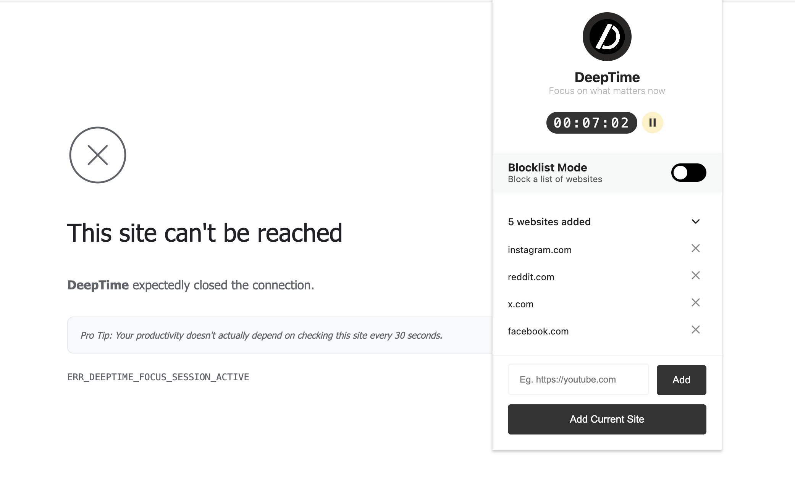

# DeepTime

## 💡 About

**DeepTime** is a modern, open-source Chrome extension that helps you reclaim your focus and productivity by blocking or allowing distracting websites during your chosen focus sessions. With a beautiful Material-inspired UI, DeepTime lets you easily toggle between blocklist and allowlist modes, track your productive time, and manage your site lists, all with privacy as a top priority.

## 🔒 Privacy

DeepTime is privacy-first:
- No analytics, tracking, or data collection.
- All settings are stored locally using Chrome's `storage.sync`.
- No data ever leaves your device.

## 🧪 How to Run DeepTime in Chrome (Test/Developer Mode)

1. Download or clone this repository to your computer.
2. Open Chrome and go to `chrome://extensions`.
3. Enable **Developer mode** (toggle in the top right).
4. Click **Load unpacked** and select the `deeptime` folder.
5. The DeepTime icon will appear in your Chrome toolbar. Click it to open the popup and start using the extension.

You can now test all features as if the extension was installed from the Chrome Web Store.

## 🧑‍💻 Contributing

Contributions are welcome!  
Feel free to open issues, submit pull requests, or suggest features.

**To contribute:**
1. Fork this repository.
2. Create a new branch for your feature or fix.
3. Submit a pull request with a clear description.

## 📄 License

This project is licensed under the [MIT License](LICENSE).

## 🙏 Acknowledgements

- Inspired by the need for mindful, distraction-free browsing.
- Built with [Chrome Extensions API](https://developer.chrome.com/docs/extensions/).

## 💬 Feedback & Support

- [Open an issue](https://github.com/aakashpandey/deeptime/issues) for bugs or feature requests.
- For questions, reach out via GitHub Discussions or email.

---

Stay focused. Reclaim your time.

